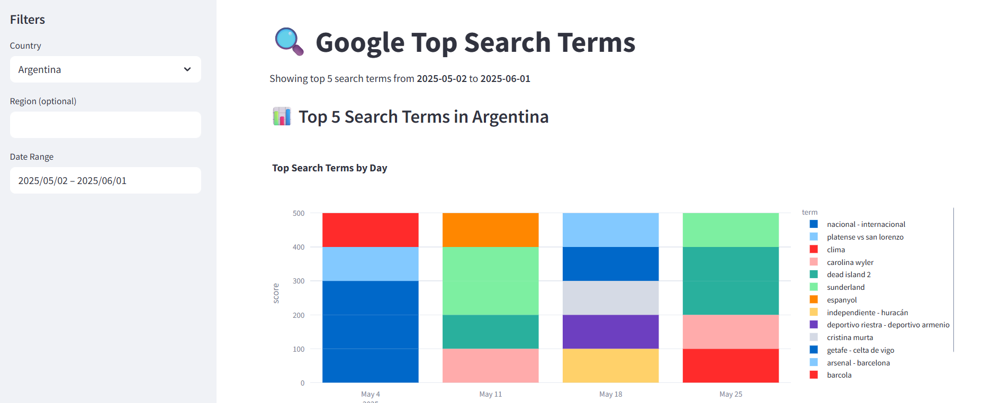
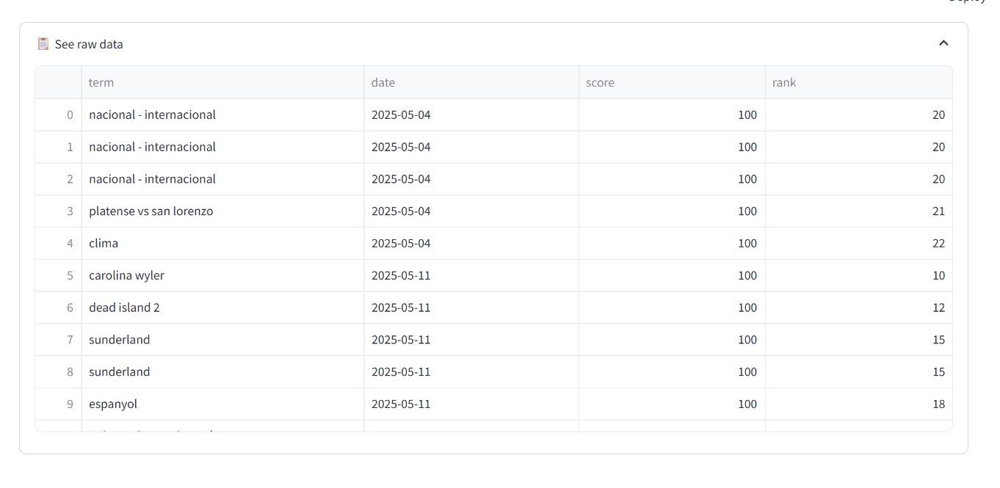
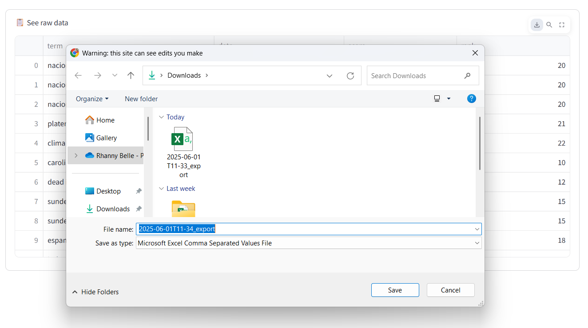

# TopSearchTerms-Streamlit App
This is a Streamlit app that lets users view the top search terms per country. App provides visuals and raw table data. Raw data and visuals can be downloaded per country.

# 🔍 Google Top Search Terms Dashboard

This Streamlit web app visualizes the top 5 Google search terms by country using real-time data from BigQuery's public Google Trends dataset.

> 🚀 Built with [Streamlit](https://streamlit.io/) + [Google BigQuery](https://cloud.google.com/bigquery)

## 📸 Screenshots

### 🔗 Main Dashboard


### 📊 Raw Data & Downloads



---

## 🧠 Features

- ✅ Pulls real-time trending search terms from Google Trends via BigQuery
- 📅 Filter by **country**, and **date range**
- 📊 View results as interactive **bar charts**
- 📥 Expandable raw data table
- 📊 Downloadable barcharts and raw data table as CSV
- 🔐 Secure BigQuery credentials via json file 

---

## 🚀 Run Locally to Localhost or Deploy it via Streamlit Cloud

### 1. Clone the repository
```bash
git clone https://github.com/rnx2024/TopSearchTerms-Streamlit.git
cd TopSearchTerms-Streamlit
